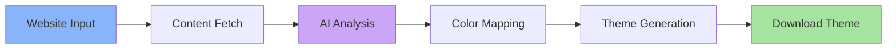

# Catppuccin Theme Generator

[](https://github.com/catppuccin/catppuccin)

AI-powered website theme generator that analyzes any webpage and creates Catppuccin-themed stylesheets while preserving the original layout perfectly.

## Table of Contents
- [Introduction](#introduction)
- [Key Features](#key-features)
- [How It Works](#how-it-works)
- [Layout Preservation](#layout-preservation)
- [Content Input Methods](#content-input-methods)
- [AI Provider Options](#ai-provider-options)
- [Usage](#usage)
- [Technical Architecture](#technical-architecture)
- [Deployment](#deployment)
- [Contributors](#contributors)
- [Future Roadmap](#future-roadmap)

## Introduction

Transform any website into beautiful Catppuccin themes without changing the layout! This web application uses AI to analyze website colors and intelligently maps them to the Catppuccin color palette.

Built with:
- **Framework**: React 19 + Vite + TypeScript
- **Styling**: Tailwind CSS
- **AI Integration**: OpenRouter, Chutes AI, Ollama
- **Client-side Processing**: No backend required

Supports all 4 Catppuccin flavors:
- ☕ **Latte** (Light theme)
- 🍧 **Frappé** (Medium dark)
- 🎨 **Macchiato** (Dark)
- 🖤 **Mocha** (Darkest)

## Key Features

### 🎨 Smart Color Mapping
- AI-powered analysis of website color schemes
- Intelligent mapping to Catppuccin's 26-color palette
- 15 customizable accent colors (Blue, Lavender, Mauve, etc.)
- Analogous harmony system (±72° bi-accents)

### 🔒 Perfect Layout Preservation
- **Colors only** - Zero layout, spacing, or sizing changes
- Preserves borders, margins, padding, fonts
- Protects gradient text and brand elements
- CSS exclusion system for original design elements

### 📥 Multiple Input Methods
- **Direct URL Fetch** - Enter any website URL
- **MHTML Upload** - Upload saved webpage archives
- **Directory Upload** - Upload complete site directories with CSS

### 🤖 Flexible AI Options
- **OpenRouter** - Free & premium models (DeepSeek, Llama, Gemma, Claude, GPT)
- **Chutes AI** - Alternative AI provider with free tier
- **Ollama** - Local AI models (no API key required)

### 📦 Multiple Output Formats
- **UserStyle** (.user.less) - Comprehensive multi-flavor theme
- **Stylus** (.styl) - Stylus preprocessor format
- **LESS** (.less) - LESS preprocessor format
- **CSS** (.css) - Pure CSS output

## How It Works



1. **Input**: Provide website URL, MHTML file, or directory
2. **Fetch**: Extract HTML, CSS, and computed styles
3. **Analyze**: AI identifies colors and UI patterns
4. **Map**: Colors mapped to Catppuccin palette intelligently
5. **Generate**: Theme created with strict layout preservation
6. **Download**: Get UserStyle/Stylus/LESS/CSS files

## Layout Preservation

This is a **color-only theme generator**. The AI is specifically instructed to:

### ✅ ONLY Modify
- `color` - Text colors
- `background-color` - Background colors
- `border-color` - Border colors (not width!)
- `box-shadow` - Shadow colors (not spread/blur)
- `outline-color` - Outline colors
- SVG `fill` and `stroke` colors

### ❌ NEVER Modify
- Layout properties (`width`, `height`, `padding`, `margin`)
- Positioning (`top`, `left`, `position`, `transform`)
- Typography (`font-size`, `font-weight`, `line-height`)
- Borders (`border-width`, `border-radius`)
- Flex/Grid (`display`, `flex-direction`, `justify-content`)
- Opacity, z-index, overflow

### 🎯 Special Protections
- **Gradient Text**: Elements with `bg-clip-text` keep original colors
- **Brand Elements**: Colorful gradients preserved for visual identity
- **CSS Exclusions**: Multiple protection layers in generated stylesheets

## Content Input Methods

### Direct URL Fetch
```typescript
// Enter any public website URL
https://example.com
```
Direct HTTP/HTTPS fetching - no external crawler needed!

### MHTML Upload
```
Save webpage as .mhtml (Chrome: Save As → Webpage, Complete)
Upload the .mhtml file for offline analysis
```

### Directory Upload
```
Upload complete website directory with:
- HTML files
- CSS files
- Asset files
```
Best for detailed CSS analysis and local testing.

## AI Provider Options

### OpenRouter
- **Free Models**: `meta-llama/llama-3.2-11b-vision-instruct:free`, `google/gemma-2-9b-it:free`, `deepseek/deepseek-r1-distill-llama-70b:free`
- **Premium Models**: Claude 3.5 Sonnet, GPT-4, Gemini Pro
- API Key: Get from [openrouter.ai](https://openrouter.ai)

### Chutes AI
- Free tier available
- Alternative AI provider
- API Key: Get from [chutes.ai](https://chutes.ai)

### Ollama
- **Local AI models** - No API key required
- Run on localhost (default: `http://localhost:11434`)
- Cloud option: Custom Ollama URL
- Models: Llama 3.2, Mistral, Qwen, etc.

## Usage

### Quick Start

1. **Choose Input Method**
   - Enter website URL, or
   - Upload MHTML file, or
   - Upload website directory

2. **Configure AI Provider**
   - Select provider (OpenRouter/Chutes/Ollama)
   - Enter API key (or Ollama URL)
   - Choose AI model

3. **Select Accent Color**
   - Pick from 15 Catppuccin accents
   - Blue, Lavender, Mauve, Pink, etc.
   - Bi-accents calculated automatically

4. **Generate Theme**
   - Click "Generate Theme"
   - Watch AI thinking process
   - Preview generated theme

5. **Download & Install**
   - Download .user.less file
   - Install in Stylus browser extension
   - Enjoy your Catppuccin theme!

See [QUICKSTART.md](QUICKSTART.md) for detailed step-by-step instructions.

## Technical Architecture

### Processing Pipeline
```
Input → Fetch Content → Extract Colors & Styles →
AI Analysis → Color Mapping → Theme Generation →
Layout Preservation → Output (UserStyle/Stylus/LESS/CSS)
```

### Project Structure
```
src/
├── components/        # React UI components
├── services/
│   ├── ai/           # AI provider clients
│   │   ├── openrouter.ts
│   │   ├── chutes.ts
│   │   └── ollama.ts
│   ├── generators/   # Theme generators
│   │   ├── userstyle.ts  # Main generator
│   │   ├── stylus.ts
│   │   ├── less.ts
│   │   └── css.ts
│   └── fetcher.ts    # Content fetching
├── types/            # TypeScript types
├── constants/        # Catppuccin colors
└── utils/            # Helper functions
```

### Security
- API keys stored in browser localStorage only
- No backend server - all processing client-side
- Keys never sent except to chosen AI provider
- Option to clear keys after use

## Deployment

Multiple deployment options - see [DEPLOYMENT.md](DEPLOYMENT.md):

- **GitHub Pages** (Recommended) - Free static hosting
- **Vercel** - Instant deployment with git integration
- **Netlify** - Alternative free hosting
- **Self-hosted** - Run on your own server
- **Docker** - Containerized deployment

### Quick Deploy

```bash
# Development
npm install
npm run dev

# Production build
npm run build

# Deploy to GitHub Pages
npm run deploy
```

## Contributors

### AI Models Used
- Claude Opus 4.1
- Claude Sonnet 4.5
- DeepSeek R1
- Llama 3.2
- Gemini Pro
- GPT-4/5

### Development Tools
- React 19 + Vite
- TypeScript
- Tailwind CSS
- OpenRouter/Chutes/Ollama APIs
- Claude Code (Development)
- Roo Code (Development)

## Future Roadmap

- [ ] SCSS/PostCSS output formats
- [ ] Live theme preview with website simulation
- [ ] Batch processing multiple URLs
- [ ] Theme sharing/export to GitHub
- [ ] Browser extension integration
- [ ] Advanced color mapping controls
- [ ] Theme testing/validation tools

See [AGENTS.md](AGENTS.md) for implementation guide and enhancement details.

---

**Built with ❤️ using the [Catppuccin](https://github.com/catppuccin/catppuccin) color palette**