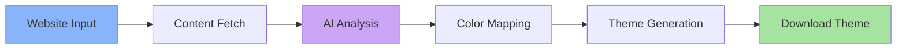

# Catppuccin Theme Generator

[](https://github.com/catppuccin/catppuccin)

AI-powered website theme generator that analyzes any webpage and creates Catppuccin-themed stylesheets while preserving the original layout perfectly.

## Table of Contents
- [Introduction](#introduction)
- [Key Features](#key-features)
- [How It Works](#how-it-works)
- [Layout Preservation](#layout-preservation)
- [Content Input Methods](#content-input-methods)
- [AI Provider Options](#ai-provider-options)
- [Usage](#usage)
- [Technical Architecture](#technical-architecture)
- [Deployment](#deployment)
- [Contributors](#contributors)
- [Future Roadmap](#future-roadmap)

## Introduction

Transform any website into beautiful Catppuccin themes without changing the layout! This web application uses AI to analyze website colors and intelligently maps them to the Catppuccin color palette.

Built with:
- **Framework**: React 19 + Vite + TypeScript
- **Styling**: Tailwind CSS, Catppuccin colors
- **AI Integration**: OpenRouter, Chutes AI, Ollama
- **Client-side Processing**: No backend required

Supports all 4 Catppuccin flavors:
- ☕ **Latte** (Light theme)
- 🍧 **Frappé** (Medium dark)
- 🎨 **Macchiato** (Dark)
- 🖤 **Mocha** (Darkest)

## Key Features

### 🎨 Smart Color Mapping
- AI-powered analysis of website color schemes
- Intelligent mapping to Catppuccin's 26-color palette
- 15 customizable accent colors (Blue, Lavender, Mauve, etc.)
- Analogous harmony system (±72° bi-accents)
- Deterministic accent plan seeded from each site’s palette profile (no randomness)

### 🔒 Perfect Layout Preservation
- **Colors only** - Zero layout, spacing, or sizing changes
- Preserves borders, margins, padding, fonts
- Protects gradient text and brand elements
- CSS exclusion system for original design elements

### 📥 Multiple Input Methods
- **Direct URL Fetch** - Enter any website URL and crawl it automatically
- **Playwright Integration** - Optional microservice captures fully rendered pages (JS, lazy-loaded content)

### 🧭 Diagnostics & Caching
- Palette diagnostics (CSS var count, inferred roles, warnings) in the right column
- Per-site palette profile caching in localStorage for faster regenerations
- Fallback warnings when Playwright is unavailable (automatic switch to HTTP fetch)

### 🤖 Flexible AI Options
- **OpenRouter** - Free & premium models (DeepSeek, Llama, Gemma, Claude, GPT)
- **Chutes AI** - Alternative AI provider with free tier
- **Ollama** - Local AI models (no API key required)

### 📦 Multiple Output Formats
- **UserStyle** (.user.less) - Comprehensive multi-flavor theme

## How It Works



1. **Input**: Provide website URL (optionally backed by the Playwright crawler)
2. **Fetch**: Extract HTML, CSS, and computed styles
3. **Analyze**: AI identifies colors and UI patterns
4. **Map**: Colors mapped to Catppuccin palette intelligently
5. **Generate**: Theme created with specific format
6. **Copy**: Get LESS codes

## Layout Preservation

This is a **color-only theme generator**. The AI is specifically instructed to:

### ✅ ONLY Modify
- `color` - Text colors
- `background-color` - Background colors


### ❌ NEVER Modify
- Layout properties (`width`, `height`, `padding`, `margin`)
- Positioning (`top`, `left`, `position`, `transform`)
- Typography (`font-size`, `font-weight`, `line-height`)
- Borders (`border-width`, `border-radius`)
- Flex/Grid (`display`, `flex-direction`, `justify-content`)
- Opacity, z-index, overflow

## Content Input Methods

### Direct URL Fetch
```typescript
// Enter any public website URL
https://example.com
```
Direct HTTP fetching is built in. For sites that require JS rendering, set up the Playwright crawler and provide its endpoint in **API Key Configuration → Playwright Crawler**. When configured, the app will prefer Playwright and fall back to HTTP proxies automatically.

### Playwright Crawler (Optional)
Run the bundled service locally:
```bash
npm install
npm run crawler:serve
# defaults to http://localhost:8787/crawl
```
Then paste `http://localhost:8787/crawl` into the Playwright endpoint field and (optionally) set a bearer token for authentication.

## AI Provider Options

### OpenRouter
- **Free Models**: `meta-llama/llama-3.2-11b-vision-instruct:free`, `google/gemma-2-9b-it:free`, `deepseek/deepseek-r1-distill-llama-70b:free`
- **Premium Models**: Claude 3.5 Sonnet, GPT-4, Gemini Pro
- API Key: Get from [openrouter.ai](https://openrouter.ai)

### Chutes AI
- Free tier available
- Alternative AI provider
- API Key: Get from [chutes.ai](https://chutes.ai)

### Ollama
- **Local AI models** - No API key required
- Run on localhost (default: `http://localhost:11434`)
- Cloud option: Custom Ollama URL
- Models: Llama 3.2, Mistral, Qwen, etc.

## Usage

### Quick Start

1. **Choose Input Method**
   - Enter website URL (Playwright crawler optional but recommended)

2. **Configure AI Provider**
   - Select provider (OpenRouter/Chutes/Ollama)
   - Enter API key (or Ollama URL)
   - Choose AI model

3. **Select Accent Color**
   - Pick from 15 Catppuccin accents
   - Blue, Lavender, Mauve, Pink, etc.
   - Bi-accents calculated automatically

4. **Generate Theme**
   - Click "Generate Theme"
   - Watch AI thinking process
   - Preview generated theme

5. **Copy to clipboard & Install**
   - Copy the generated code
   - Install in Stylus browser extension
   - Enjoy your Catppuccin theme!

See [QUICKSTART.md](QUICKSTART.md) for detailed step-by-step instructions.

## Playwright Crawler Setup

The Playwright service ships with this repo so you can capture computed styles and lazy-rendered UI:

```bash
npm install
npx playwright install chromium
npm run crawler:serve
# defaults to http://localhost:8787/crawl
```

Optional environment variables:
- `CRAWLER_PORT` to change the port (default `8787`)
- `CRAWLER_KEY` to require a bearer token for requests

Expose the endpoint via a tunnel (Cloudflare, ngrok, etc.) if you’re running the UI on GitHub Pages or another remote host. Finally, open **API Key Configuration → Playwright Crawler** and paste the endpoint + key. The app will automatically use Playwright when those fields are present and fall back to the built-in HTTP fetcher when not.

If you see `Playwright Chromium browser is not installed`, run:
```bash
npx playwright install chromium
# or on Linux servers
npx playwright install --with-deps chromium
```
and restart `npm run crawler:serve`.

## Technical Architecture

### Processing Pipeline
```
Input → Fetch Content → Extract Colors & Styles →
AI Analysis → Color Mapping → Theme Generation → Output (LESS)
```

### Project Structure
```
src/
├── components/        # React UI components
├── services/
│   ├── ai/           # AI provider clients
│   │   ├── openrouter.ts
│   │   ├── chutes.ts
│   │   └── ollama.ts
│   ├── generators/   # Theme generators
│   │   ├── userstyle.ts  # Main generator
│   │   ├── stylus.ts
│   │   ├── less.ts
│   │   └── css.ts
│   └── fetcher.ts    # Content fetching
├── types/            # TypeScript types
├── constants/        # Catppuccin colors
└── utils/            # Helper functions
```

### Security
- API keys stored in browser localStorage only
- No backend server - all processing client-side
- Keys never sent except to chosen AI provider
- Option to clear keys after use

## Deployment

Multiple deployment options - see [DEPLOYMENT.md](DEPLOYMENT.md):

- **GitHub Pages** (Recommended) - Free static hosting
- **Vercel** - Instant deployment with git integration
- **Netlify** - Alternative free hosting
- **Self-hosted** - Run on your own server
- **Docker** - Containerized deployment

### Quick Deploy

```bash
# Development
npm install
npm run dev

# Production build
npm run build

# Deploy to GitHub Pages
npm run deploy
```

## Contributors

### AI Models Used
- Claude Opus 4.1
- Claude Sonnet 4.5
- DeepSeek R1
- Llama 3.2
- Gemini Pro
- GPT-5.Codex
- GPT-5.1/Codex

### Development Tools
- React 19 + Vite 6
- TypeScript
- Tailwind CSS
- Claude Code (Development)
- OpenAI Codex (Development)
- Gemini Code Assistant (Development)
- Roo Code (Development)
- GitHub Copilot (Development)

## Future Roadmap
- [ ] Per-site caching UX: “Re-run with same crawl” (reuse palette profile & class-role guesses while changing model/mapping)
- [ ] Diagnostics upgrades: warning tips and palette profile JSON download
- [ ] Playwright status badge (Connected/Fallback + last test time)
- [ ] Guardrails: retry on 429/503 and clearer parse-error toasts for AI calls
- [ ] Style polish toggles: alerts/notifications plus configurable badge/card/table accent coverage
- [ ] Theme sharing/export to GitHub
- [ ] Browser extension integration

See [AGENTS.md](AGENTS.md) for implementation guide and enhancement details.

---

**Built with ❤️ using the [Catppuccin](https://github.com/catppuccin/catppuccin) color palette**
