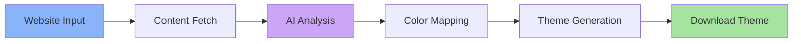

# Catppuccin Theme Generator

[](https://github.com/catppuccin/catppuccin)

AI-powered website theme generator that analyzes any webpage, builds a palette profile, and creates Catppuccin-themed UserStyles while preserving the original layout.

## Table of Contents
- [Introduction](#introduction)
- [Key Features](#key-features)
- [How It Works](#how-it-works)
- [Layout Preservation](#layout-preservation)
- [Content Input Methods](#content-input-methods)
- [AI Provider Options](#ai-provider-options)
- [Usage](#usage)
- [Technical Architecture](#technical-architecture)
- [Deployment](#deployment)
- [Contributors](#contributors)
- [Future Roadmap](#future-roadmap)

## Introduction

Transform any website into beautiful Catppuccin themes without changing the layout. The app fetches page content via an API-based chain, derives a palette profile, and maps colors to the Catppuccin palette with optional AI-assisted selector hints.

Built with:
- **Framework**: React 19 + Vite + TypeScript
- **Styling**: Tailwind CSS, Catppuccin colors
- **AI Integration**: OpenRouter, Chutes AI, Ollama
- **Content Fetching**: API-based chain (Firecrawl → Jina → ScrapingBee → Browserless → CORS proxy)
- **Client-side Processing**: Static frontend; keys are stored locally in your browser

Supports all 4 Catppuccin flavors:
- ☕ **Latte** (Light theme)
- 🍧 **Frappé** (Medium dark)
- 🎨 **Macchiato** (Dark)
- 🖤 **Mocha** (Darkest)

## Key Features

### 🎨 Smart Color Mapping
- AI-powered analysis of the site palette with optional AI-assisted selector mapping
- Deterministic accent plan seeded from each site’s palette profile (no randomness)
- 15 Catppuccin accents plus bi-accent rotations for variety
- Accent coverage toggles for badges/cards/tables and alerts
- Optional normal/mono font overrides

### 🔒 Perfect Layout Preservation
- **Colors only** - Zero layout, spacing, or sizing changes
- Preserves borders, margins, padding, fonts
- Protects gradient text and brand elements
- CSS exclusion system for original design elements

### 📥 Flexible Fetching
- Auto fetcher chain: Firecrawl (with key) → Jina Reader → ScrapingBee (with key) → Browserless (with key) → CORS proxy
- Configure preferred service and keys in **Web Fetcher Configuration**
- Playwright endpoint fields remain for experimentation, but the shipped UI uses the API-based chain today

### 🧭 Diagnostics & Caching
- Palette diagnostics (CSS var count, inferred roles, warnings) in the right column
- Palette profile download for debugging
- Per-site palette profile caching in localStorage for fast regenerations
- Parse-error toast if an AI response cannot be read

### 🤖 Flexible AI Options
- **OpenRouter** - Free & premium models (DeepSeek, Llama, Gemma, Claude, GPT)
- **Chutes AI** - Alternative AI provider with free tier
- **Ollama** - Local AI models (no API key required)

### 📦 Output
- **UserStyle (.user.less)** - Multi-flavor theme with palette-profile-driven role mapping and accent plan

## How It Works



1. **Input**: Provide website URL
2. **Fetch**: API-based chain gathers HTML/CSS (Firecrawl → Jina → ScrapingBee → Browserless → CORS proxy)
3. **Profile**: Palette profile built with diagnostics and accent seed
4. **Analyze**: AI identifies colors and optional class roles
5. **Map**: Colors mapped to Catppuccin palette with accent plan
6. **Generate**: UserStyle (.user.less) emitted and ready to copy/download

## Layout Preservation

This is a **color-only theme generator**. The AI is specifically instructed to:

### ✅ ONLY Modify
- `color` - Text colors
- `background-color` - Background colors


### ❌ NEVER Modify
- Layout properties (`width`, `height`, `padding`, `margin`)
- Positioning (`top`, `left`, `position`, `transform`)
- Typography (`font-size`, `font-weight`, `line-height`)
- Borders (`border-width`, `border-radius`)
- Flex/Grid (`display`, `flex-direction`, `justify-content`)
- Opacity, z-index, overflow

## Content Input Methods

### Direct URL Fetch (Auto chain)
```typescript
// Enter any public website URL
https://example.com
```
By default the app uses the API-based chain:
- Firecrawl (if key set) → Jina Reader → ScrapingBee (if key set) → Browserless (if key set) → CORS proxy
- Configure your preferred service and keys in **Web Fetcher Configuration** (Auto is recommended).

### Playwright Crawler (Legacy/Optional)
You can still run the bundled Playwright service locally:
```bash
npm install
npm run crawler:serve
# defaults to http://localhost:8787/crawl
# env: CRAWLER_PORT=8787, CRAWLER_KEY=your-token, CRAWLER_TIMEOUT=60000 (ms)
```
Paste the endpoint/key into **API Key Configuration → Playwright Crawler** if you want to experiment with a self-hosted crawl. The production UI flow uses the API-based chain today.

### Contrast & Diagnostics
- Palette profiles now emit basic contrast warnings (e.g., text vs background, accent vs surface) and will auto-fallback to safer palette text when needed.
- Palette Diagnostics panel surfaces warnings plus tips to improve coverage (connect Playwright, include CSS variables, prefer semantic tokens).
- Class colors favor role guesses and class-name hints: primary/CTA → accent, secondary/nav/link → bi-accent1, badge/tag → bi-accent2; status roles map to Catppuccin greens/yellows/reds/sapphires.

## AI Provider Options

### OpenRouter
- **Free Models (in code as of 2025-12-01)**: `x-ai/grok-4.1-fast:free`, `qwen/qwen3-235b-a22b:free`, `qwen/qwen3-coder:free`, `moonshotai/kimi-k2:free`, `openai/gpt-oss-20b:free`, `alibaba/tongyi-deepresearch-30b-a3b:free`, `meituan/longcat-flash-chat:free`, `z-ai/glm-4.5-air:free`, `tngtech/deepseek-r1t2-chimera:free`, `tngtech/deepseek-r1t-chimera:free`, `google/gemma-3-27b-it:free`, `google/gemini-2.0-flash-exp:free`, `meta-llama/llama-3.3-70b-instruct:free`, `nousresearch/hermes-3-llama-3.1-405b:free`, `mistralai/mistral-small-3.1-24b-instruct:free`
- **Premium Models**: GPT-4o, Claude 3.5 Sonnet, Gemini Pro, Llama 3.1 70B
- API Key: Get from [openrouter.ai](https://openrouter.ai)

### Chutes AI
- Paid models with competitive pricing; see [llm.chutes.ai](https://llm.chutes.ai/v1/models)
- API Key: Get from [chutes.ai](https://chutes.ai)

### Ollama
- **Local AI models** - No API key required
- Run on localhost (default: `http://localhost:11434`)
- Cloud option: Custom Ollama URL
- Models: Llama 3.2, Mistral, Qwen, etc.

## Usage

### Quick Start

1. **Configure Fetcher**
   - Open **Web Fetcher Configuration**
   - Leave on **Auto** (recommended) or pick a service
   - Add Firecrawl/ScrapingBee/Browserless keys if you have them; Jina works with no key

2. **Configure AI Provider**
   - Select provider (OpenRouter/Chutes/Ollama)
   - Enter API key (Ollama URL optional for cloud)
   - Pick a model (defaults to DeepSeek R1T2 Chimera free on OpenRouter)

3. **Accent & Fonts**
   - Pick a Catppuccin accent (bi-accents are auto-calculated)
   - Toggle accent coverage for badges/cards/tables and alerts
   - Set normal/mono fonts if you want overrides

4. **Generate Theme**
   - Click "Generate Theme" and watch the thinking steps
   - Optional: enable AI-assisted selector mapping for richer accent rotation
   - Re-run with the same crawl to compare models instantly

5. **Copy/Download**
   - Download or copy the generated `.user.less`
   - Install in Stylus/Cascadea and enjoy your Catppuccin theme

See [QUICKSTART.md](QUICKSTART.md) for detailed step-by-step instructions.

## Playwright Crawler Setup (Optional)

The shipped UI relies on the API-based fetcher chain. If you still want to run the bundled Playwright microservice for local snapshots:

```bash
npm install
npx playwright install chromium
npm run crawler:serve
# defaults to http://localhost:8787/crawl
```

Environment variables:
- `CRAWLER_PORT` (default `8787`)
- `CRAWLER_KEY` (optional bearer token)
- `CRAWLER_TIMEOUT` (ms)

Paste the endpoint/key into **API Key Configuration → Playwright Crawler**. Treat this as an experimental/legacy path; the primary flow continues to use Firecrawl/Jina/ScrapingBee/Browserless/CORS proxy.

## Technical Architecture

### Processing Pipeline
```
Input → Fetch Content (API chain) → Palette Profile →
AI Analysis → Color Mapping → Theme Generation → Output (UserStyle)
```

### Project Structure
```
src/
├── components/        # React UI components
├── services/
│   ├── ai/             # AI provider clients
│   ├── generators/     # UserStyle v1/v2/v3 + legacy Stylus/LESS/CSS
│   ├── fetcher-api.ts  # API-based fetching (Firecrawl/Jina/ScrapingBee/Browserless/CORS)
│   ├── fetcher-v2.ts   # Deep-analysis fetcher
│   └── fetcher.ts      # Legacy Playwright + proxy fetcher
├── types/            # TypeScript types
├── constants/        # Catppuccin colors
└── utils/            # Helper functions
```

### Security
- AI/fetcher/crawler keys stored in browser localStorage only
- No backend server - all processing client-side
- Keys never sent except to chosen provider/service
- Option to clear keys after use

## Deployment

Multiple deployment options - see [DEPLOYMENT.md](DEPLOYMENT.md):

- **GitHub Pages** (Recommended) - Free static hosting
- **Vercel** - Instant deployment with git integration
- **Netlify** - Alternative free hosting
- **Self-hosted** - Run on your own server
- **Docker** - Containerized deployment

### Quick Deploy

```bash
# Development
npm install
npm run dev

# Production build
npm run build

# Deploy to GitHub Pages
npm run deploy
```

## Contributors

### AI Models Used
- Claude Opus 4.5
- Claude Opus 4.1
- Claude Sonnet 4.5
- DeepSeek R1
- Llama 3.2
- Gemini Pro
- GPT-5.Codex
- GPT-5.1/Codex

### Development Tools
- React 19 + Vite 6
- TypeScript
- Tailwind CSS
- Claude Code (Development)
- OpenAI Codex (Development)
- Gemini Code Assistant (Development)
- Roo Code (Development)
- GitHub Copilot (Development)

## Deep Analysis & V3 (Advanced)

- **Pipeline**: `runDeepAnalysisPipeline` stitches enhanced fetcher → deep mapper → generator. Pass `{ url, flavor, mainAccent, mapper: { provider, apiKey, model }, useV3Generator?: boolean }` to get `{ analysis, mappings, userstyle }`.
- **V3 generator**: Multi-flavor + multi-accent UserStyle with cascading bi-accent gradients and higher coverage. Programmatic entry: `generateUserstyleV3(analysis, mappings, { url, defaultFlavor, defaultAccent })`.
- **UI output**: The UI currently emits the palette-profile-driven UserStyle (v2 path). Use the pipeline to emit V3 themes or to automate deep-analysis runs.
- **Fetchers**: Deep analysis uses `fetcher-v2` (API chain + CSS/SVG/selector introspection) before mapping, then the generator.

## Future Roadmap
- [x] Per-site caching UX: “Re-run with same crawl” (reuse palette profile & class-role guesses while changing model/mapping)
- [x] Diagnostics upgrades: warning tips and palette profile JSON download
- [ ] Playwright status badge (Connected/Fallback + last test time)
- [ ] Guardrails: retry on 429/503 and clearer parse-error toasts for AI calls
- [ ] Style polish toggles: alerts/notifications plus configurable badge/card/table accent coverage
- [ ] Theme sharing/export to GitHub
- [ ] Browser extension integration

---

**Built with ❤️ using the [Catppuccin](https://github.com/catppuccin/catppuccin) color palette**
